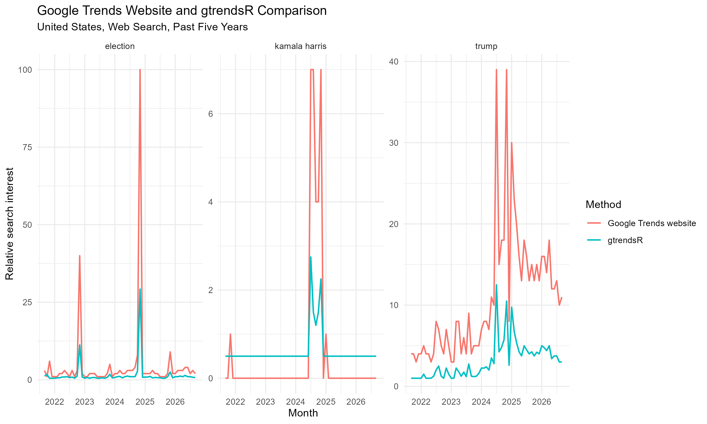

## Data Datasheet

| Query parameter | Selection |
|---|---|
| Search terms | Trump, Kamala Harris, Election |
| Geography | United States |
| Time window | Past five years: September 16, 2021–September 16, 2026 |
| Category | All categories |
| Search type | Web Search |
| Website retrieval date and time | September 16, 2026, approximately 10:50 a.m. |
| R retrieval date | September 16, 2026 |
| Unit | Relative search interest, normalized from 0 to 100 |
| Collection methods | Google Trends website and `gtrendsR` |

This datasheet records the parameters used to collect the Google Trends
data. The values represent normalized relative search interest rather than
the number of searches.


```{r}
## EPPS 6302 Methods of Data Collection and Production
## Google Trends with R

library(gtrendsR)
library ("readr")
TrumpHarrisElection = gtrends(c("Trump","Harris","election"), onlyInterest = TRUE, geo = "US", gprop = "web", time = "today+5-y", category = 0, ) # last five years
the_df=TrumpHarrisElection$interest_over_time
plot(TrumpHarrisElection)
tg = gtrends("tariff", time = "all")

# Cache the raw pull - the next call will not return the same numbers
write_csv(the_df, paste0("gtrends_us_5y_", Sys.Date(), ".csv"))


## 1. One term over its full history
trump_full <- gtrends("Trump",
                      onlyInterest = TRUE,
                      geo      = "US",
                      gprop    = "web",
                      time     = "all",
                      category = 0)

trump_full_df <- trump_full$interest_over_time
plot(trump_full)

## 2. The same term in another country
trump_gb <- gtrends("Trump",
                    onlyInterest = TRUE,
                    geo      = "GB",
                    gprop    = "web",
                    time     = "today+5-y",
                    category = 0)

trump_gb_df <- trump_gb$interest_over_time
plot(trump_gb)

## 3. One term across three countries
trump_multi <- gtrends("Trump",
                       onlyInterest = TRUE,
                       geo      = c("US", "GB", "TW"),
                       gprop    = "web",
                       time     = "today+5-y",
                       category = 0)

trump_multi_df <- trump_multi$interest_over_time
plot(trump_multi)

## 4. Three terms, worldwide
worldwide <- gtrends(c("Trump", "Harris", "election"),
                     onlyInterest = TRUE,
                     geo      = "",       # empty string = worldwide
                     gprop    = "web",
                     time     = "today+5-y",
                     category = 0)

worldwide_df <- worldwide$interest_over_time
plot(worldwide)


# Example: Tariff, China military, Taiwan 
# 
plot(gtrends(c("tariff"), time = "all"))
data("countries")
plot(gtrends(c("tariff"), geo = "GB", time = "all")) 
plot(gtrends(c("tariff"), geo = c("US","GB","TW"), time = "all")) 
tg_iot = tg$interest_over_time
tct = gtrends(c("tariff","China military", "Taiwan"), time = "all")
names(tct)
tct_df <- data.frame(tct$interest_over_time)
plot(gtrends(c("tariff","China military", "Taiwan"), time = "all"))


## Comparing "Harris" and "Kamala Harris"

harris_compare <- gtrends(
  c("Harris", "Kamala Harris"),
  onlyInterest = TRUE,
  geo = "US",
  gprop = "web",
  time = "today+5-y",
  category = 0
)

harris_compare_df <- harris_compare$interest_over_time

plot(harris_compare)

View(harris_compare_df)

aggregate(hits ~ keyword,
          data = harris_compare_df,
          FUN = mean)

## EPPS 6302
## Assignment 2 - Part A.4(a)
## Website versus gtrendsR: Past five years

library(gtrendsR)
library(readr)
library(dplyr)
library(tidyr)
library(ggplot2)


## ---------------------------------------------------------
## 1. Pull the five-year data using gtrendsR
## ---------------------------------------------------------

r_pull <- gtrends(
  keyword = c("Trump", "Kamala Harris", "Election"),
  onlyInterest = TRUE,
  geo = "US",
  gprop = "web",
  time = "today+5-y",
  category = 0
)

r_df <- r_pull$interest_over_time

# Save the original R data
write_csv(
  r_df,
  "part4a_r_raw.csv"
)


## ---------------------------------------------------------
## 2. Read the five-year website CSV
## ---------------------------------------------------------

website_df <- read_csv(
  "time_series_US_20210916-1050_20260916-1050_Trump_Kamala Harris_Election_5 year_Gtrend web data.csv",
  show_col_types = FALSE
)

# Remove spaces from column names
names(website_df) <- trimws(names(website_df))

# Rename the first column
names(website_df)[1] <- "date"

View(website_df)


## ---------------------------------------------------------
## 3. Convert website data from wide to long format
## ---------------------------------------------------------

website_long <- website_df %>%
  pivot_longer(
    cols = -date,
    names_to = "keyword",
    values_to = "website_hits"
  ) %>%
  mutate(
    date = as.Date(date),
    month = format(date, "%Y-%m"),
    keyword = tolower(trimws(keyword)),
    website_hits = as.numeric(website_hits)
  )

View(website_long)


## ---------------------------------------------------------
## 4. Prepare the R data
## ---------------------------------------------------------

r_long <- r_df %>%
  transmute(
    date = as.Date(date),
    month = format(date, "%Y-%m"),
    keyword = tolower(trimws(keyword)),
    
    # Replace "<1" with 0.5 so that it is not converted to NA
    r_hits = ifelse(
      as.character(hits) == "<1",
      0.5,
      as.numeric(as.character(hits))
    )
  )

View(r_long)


## ---------------------------------------------------------
## 5. Convert both datasets to monthly observations
## ---------------------------------------------------------

# The website data are already monthly, but this confirms
# that there is one value per term per month.

website_monthly <- website_long %>%
  group_by(month, keyword) %>%
  summarise(
    website_hits = mean(website_hits, na.rm = TRUE),
    .groups = "drop"
  )

# Average the weekly R observations within each month.

r_monthly <- r_long %>%
  group_by(month, keyword) %>%
  summarise(
    r_hits = mean(r_hits, na.rm = TRUE),
    .groups = "drop"
  )


## ---------------------------------------------------------
## 6. Match the website and R observations
## ---------------------------------------------------------

comparison <- inner_join(
  website_monthly,
  r_monthly,
  by = c("month", "keyword")
) %>%
  mutate(
    difference = r_hits - website_hits,
    absolute_difference = abs(difference),
    
    direction = case_when(
      difference > 0 ~ "R higher",
      difference < 0 ~ "Website higher",
      TRUE ~ "Identical"
    )
  )

View(comparison)


## ---------------------------------------------------------
## 7. Calculate the differences
## ---------------------------------------------------------

comparison_summary <- comparison %>%
  group_by(keyword) %>%
  summarise(
    matched_months = n(),
    
    identical_values =
      sum(difference == 0, na.rm = TRUE),
    
    different_values =
      sum(difference != 0, na.rm = TRUE),
    
    mean_website_value =
      mean(website_hits, na.rm = TRUE),
    
    mean_R_value =
      mean(r_hits, na.rm = TRUE),
    
    mean_difference =
      mean(difference, na.rm = TRUE),
    
    mean_absolute_difference =
      mean(absolute_difference, na.rm = TRUE),
    
    maximum_absolute_difference =
      max(absolute_difference, na.rm = TRUE),
    
    general_direction = case_when(
      mean_difference > 0 ~ "R generally higher",
      mean_difference < 0 ~ "Website generally higher",
      TRUE ~ "Same average"
    ),
    
    .groups = "drop"
  )

comparison_summary


## ---------------------------------------------------------
## 8. Confirm that all three terms were matched
## ---------------------------------------------------------

table(comparison$keyword)


## ---------------------------------------------------------
## 9. Plot the two methods
## ---------------------------------------------------------

comparison_plot_data <- comparison %>%
  mutate(
    date = as.Date(paste0(month, "-01"))
  ) %>%
  select(
    date,
    keyword,
    website_hits,
    r_hits
  ) %>%
  pivot_longer(
    cols = c(website_hits, r_hits),
    names_to = "method",
    values_to = "hits"
  ) %>%
  mutate(
    method = recode(
      method,
      website_hits = "Google Trends website",
      r_hits = "gtrendsR"
    )
  )

part4a_plot <- ggplot(
  comparison_plot_data,
  aes(
    x = date,
    y = hits,
    color = method
  )
) +
  geom_line(linewidth = 0.7) +
  facet_wrap(
    ~ keyword,
    scales = "free_y"
  ) +
  labs(
    title = "Google Trends Website and gtrendsR Comparison",
    subtitle = "United States, Web Search, Past Five Years",
    x = "Month",
    y = "Relative search interest",
    color = "Method"
  ) +
  theme_minimal()

part4a_plot


## ---------------------------------------------------------
## 10. Save the outputs
## ---------------------------------------------------------

write_csv(
  website_monthly,
  "part4a_website_monthly.csv"
)

write_csv(
  r_monthly,
  "part4a_r_monthly.csv"
)

write_csv(
  comparison,
  "part4a_comparison.csv"
)

write_csv(
  comparison_summary,
  "part4a_comparison_summary.csv"
)

ggsave(
  filename = "part4a_comparison_plot.png",
  plot = part4a_plot,
  width = 10,
  height = 6,
  dpi = 300
)


## ---------------------------------------------------------
## 11. Display the saved files
## ---------------------------------------------------------

list.files(
  pattern = "^part4a_",
  full.names = TRUE
)


## 4 Part c)
pull_1 <- gtrends(
  c("Trump", "Harris", "election"),
  onlyInterest = TRUE,
  geo = "US",
  gprop = "web",
  time = "today+5-y",
  category = 0
)

pull_1_df <- pull_1$interest_over_time

write_csv(
  pull_1_df,
  "part4c_pull_1.csv"
)


## Waiting for 2 minutes before running the second block of code

pull_2 <- gtrends(
  c("Trump", "Harris", "election"),
  onlyInterest = TRUE,
  geo = "US",
  gprop = "web",
  time = "today+5-y",
  category = 0
)

pull_2_df <- pull_2$interest_over_time

write_csv(
  pull_2_df,
  "part4c_pull_2.csv"
)


## Comparing the two pulled data 2 minutes apart
pull_1_clean <- pull_1_df %>%
  transmute(
    date = as.Date(date),
    keyword = tolower(trimws(keyword)),
    pull_1_hits = ifelse(
      as.character(hits) == "<1",
      0.5,
      as.numeric(as.character(hits))
    )
  )

pull_2_clean <- pull_2_df %>%
  transmute(
    date = as.Date(date),
    keyword = tolower(trimws(keyword)),
    pull_2_hits = ifelse(
      as.character(hits) == "<1",
      0.5,
      as.numeric(as.character(hits))
    )
  )

repeated_comparison <- inner_join(
  pull_1_clean,
  pull_2_clean,
  by = c("date", "keyword")
) %>%
  mutate(
    difference = pull_2_hits - pull_1_hits,
    absolute_difference = abs(difference)
  )

View(repeated_comparison)


## Comparison Summary

repeated_summary <- repeated_comparison %>%
  group_by(keyword) %>%
  summarise(
    matched_observations = n(),
    identical_values =
      sum(difference == 0, na.rm = TRUE),
    different_values =
      sum(difference != 0, na.rm = TRUE),
    mean_difference =
      mean(difference, na.rm = TRUE),
    mean_absolute_difference =
      mean(absolute_difference, na.rm = TRUE),
    maximum_absolute_difference =
      max(absolute_difference, na.rm = TRUE),
    .groups = "drop"
  )

repeated_summary


write_csv(
  repeated_comparison,
  "part4c_repeated_comparison.csv"
)

write_csv(
  repeated_summary,
  "part4c_repeated_summary.csv"
)


```


## Comparison plot




